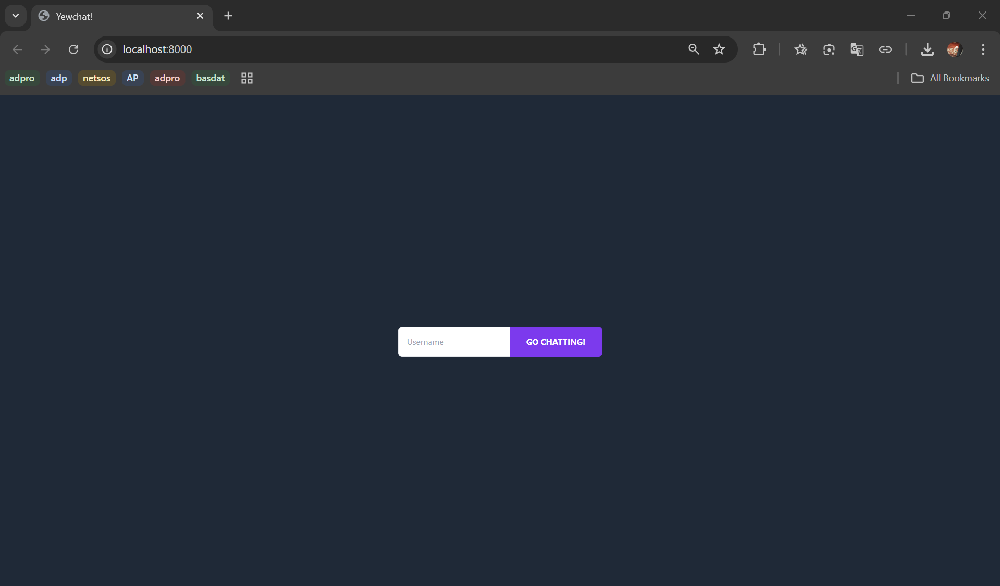
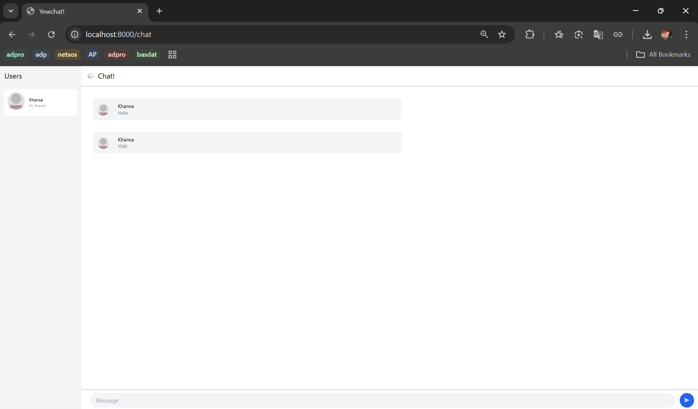
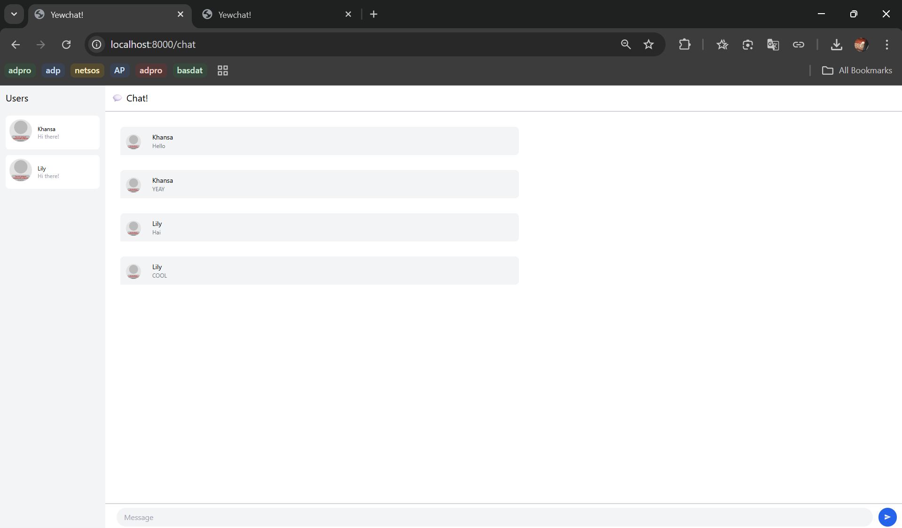
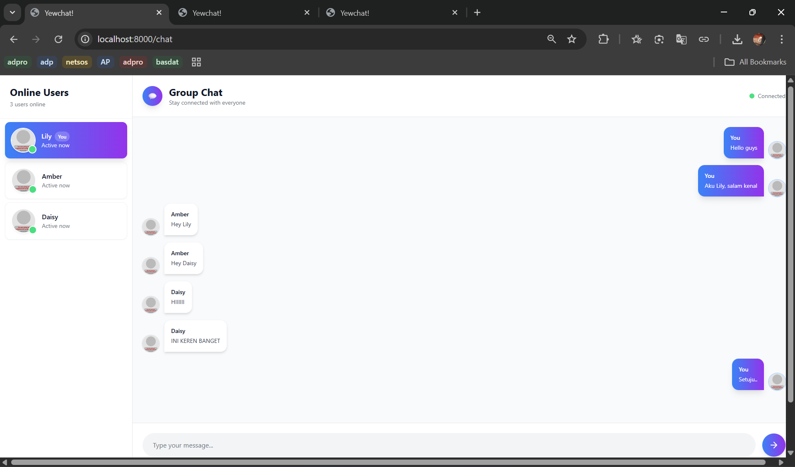
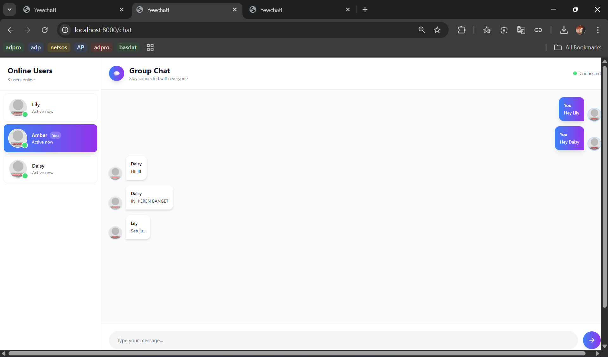

# Module 10 Tutorial: Asynchronous Programming

Advanced Programming (Even Semester 2024/2025) Tutorial Module 10

Khansa Khairunisa - 2306152462

*Server Configuration: Port 8081*

## Reflection

### Experiment 3.1: Original code

#### Tampilan Login Page

Ketika pengguna pertama kali membuka aplikasi, mereka akan langsung diarahkan ke halaman login yang sederhana dan intuitif. Di tengah halaman terdapat form input untuk mengetikkan nama pengguna (username) dan tombol “GO CHATTING!” berwarna ungu mencolok. Setelah pengguna mengetikkan username dan menekan tombol tersebut, mereka akan diarahkan ke halaman ruang obrolan utama. 

#### Tampilan Chat Page (1 pengguna)

Setelah berhasil masuk, pengguna akan melihat halaman utama aplikasi chat. Di bagian kiri terdapat daftar pengguna yang sedang online, sementara di bagian kanan ditampilkan ruang obrolan. Pada contoh ini, pengguna dengan nama "Khansa" berhasil masuk dan mengirimkan pesan. Pesan yang dikirim ditampilkan di area utama dengan identitas pengirim yang jelas.

#### Tampilan Chat Page (lebih dari 1 pengguna)

Ketika lebih dari satu pengguna aktif, seperti contoh antara "Khansa" dan "Lily", percakapan ditampilkan secara bergantian di ruang chat. Setiap pesan dilengkapi dengan nama pengguna dan isi pesan, yang memudahkan pengguna mengikuti alur percakapan. Daftar pengguna aktif di panel kiri juga ter-update untuk menampilkan semua pengguna yang sedang terhubung dengan server.

### Experiment 3.2: Be Creative!

#### Tampilan pengguna 1

#### Tampilan pengguna 2

#### Ringkasan Perubahan Design Chat

Perubahan utama pada komponen chat ini berfokus pada peningkatan user experience dan visual hierarchy. Sidebar pengguna diperlebar menjadi 320px dengan design card yang lebih modern, dilengkapi avatar beringan dan indikator status online. Sistem highlight diterapkan untuk membedakan user aktif - pengguna yang sedang login akan mendapat background gradient biru-ungu dengan badge "You", sementara pengguna lain tetap menggunakan background putih standar.

Tata letak pesan diubah mengikuti konvensi chat modern dimana pesan sendiri muncul di sebelah kanan dengan warna gradient yang konsisten, sedangkan pesan dari pengguna lain berada di kiri dengan background putih. Area input diperbaiki dengan field yang lebih besar dan tombol kirim bergradient dengan efek hover yang smooth. Seluruh interface dilengkapi dengan transisi halus, shadow yang tepat, dan spacing yang lebih baik untuk menciptakan pengalaman chat yang lebih intuitif dan profesional. Header juga ditambahkan indikator koneksi real-time untuk memberikan feedback status kepada pengguna.